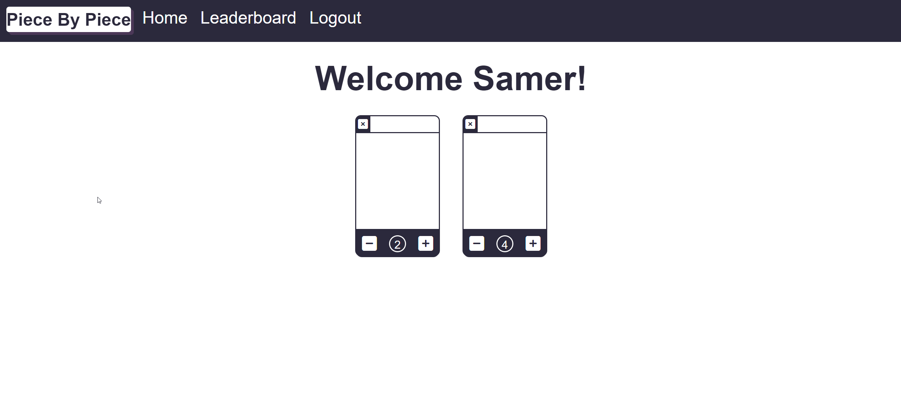

# Piece By Piece
Build habits, Piece By Piece

## The Problem
It can be really hard to build habits, and people often fail if not provided with the right insentives. What is better than competition!

## Outcomes
This project allowed me to learn more about the following;
- Javascript implimentation and use
- Express implimentation and use
- The ability to take a set of criteria and create a functional API that follows those criteria
- The use of API's and handling their data
- A deeper understanding of Heroku deployments
- A deeper understanding of Handlebars
- A deeper understanding of Javascript and it things you can do with it
- A deeper understanding of MySQL and using Express to manipulate a database

## Installation

This project is deployed on heroku through the following link:
https://piece-by-piece.herokuapp.com/login

## Usage

This project can be used as proof of concept for a site that can allow the addition and management of items to track score, and that will fill that data to a leaderbaord. To test the site we recommend using the username: smr@yahoo.com.au and password: password12345 and then the username: mohamed@gmail.com and the password: password12345

## Credits

This project was done in conjunction with the University of Sydney and Trilogy Education through their collaborated full stack bootcamp program. The collaborators on this project were Samer Balee, Aiden Brennan, Mohamed Afifi and Oliver Kelly

---